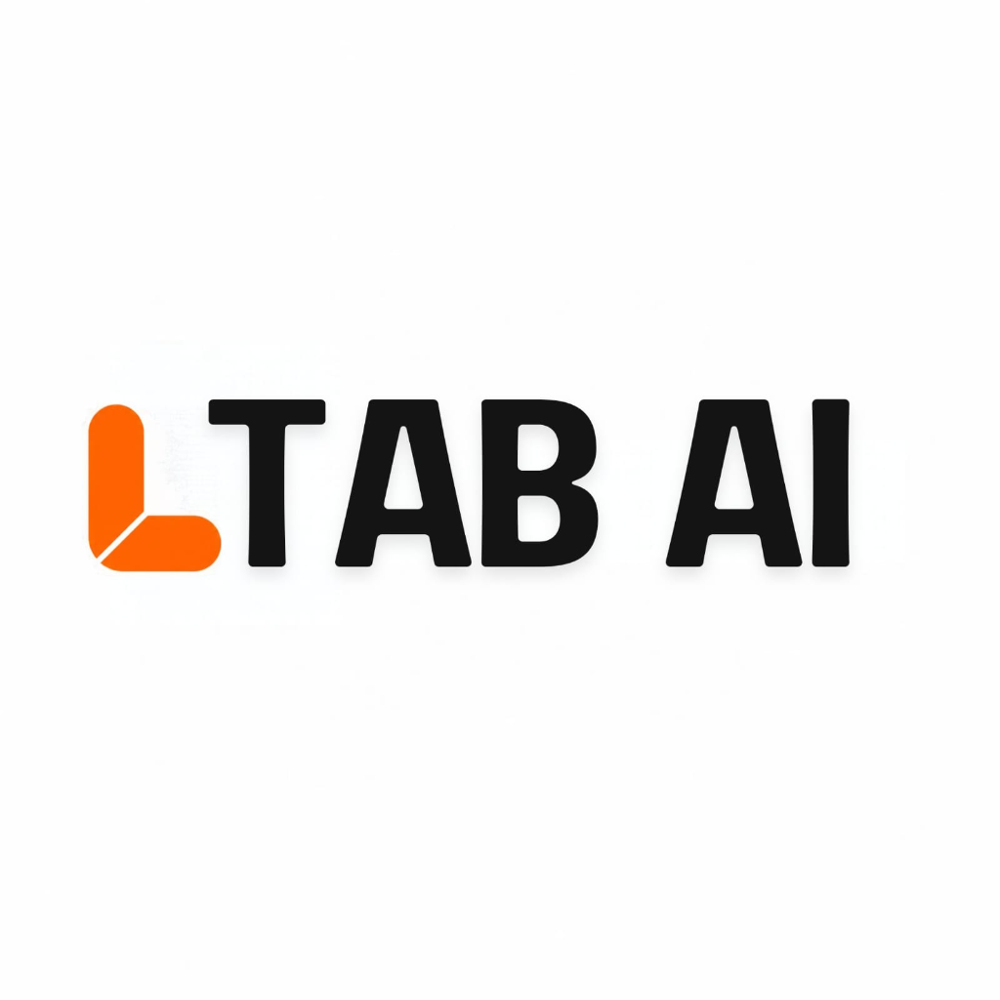

# LTAB AI — Website Map (v2)



> **Brand name check:** the logo reads **"LTAB AI"** (your notes say "L Tap AI"). This map uses **LTAB AI**. Tell me if that's wrong.
> **Logo DNA:** a rounded orange "L" made of two capsule shapes with a thin diagonal cut where they meet, plus heavy rounded black sans-serif lettering. Orange ≈ `#FF6A00`. This "L" is the main 3D element of the whole site.

---

## 1. Core ideology: the Four Freedoms

Everything on the site supports one belief:
**You don't have to fit into someone else's software. Think it, design it, build it, run it your way.**

| # | Freedom | Meaning | Line on site |
|---|---|---|---|
| 1 | **Freedom of Thinking** | Start from your idea, not from a template or a SaaS product's limits | *"Think without a template."* |
| 2 | **Freedom of Design** | Your product looks the way you picture it | *"Design it the way you see it."* |
| 3 | **Freedom of Development** | Built for your workflow, your rules, your stack | *"Built around you, not a SaaS product."* |
| 4 | **Freedom of Business** | Run your business and its processes your way, and change them whenever you want | *"Your business. Your rules. Redesign anytime."* |

**Master tagline (options):**
- *"Freedom to build."*
- *"Think it. We build it."*
- *"No templates. No limits. Just yours."*

---

## 2. Signature 3D concept: "The Free L"

The **orange L from the logo** is the main 3D object across the site.

- The L is split into **two capsules**, the same as the logo. In 3D they **separate, float, and reconnect**: two parts (you + LTAB) building one thing.
- **Hero:** visitors drag or rotate the L, pull the capsules apart, and watch them snap back together. On phones, tilting the device moves it.
- **Scroll journey:** the capsules re-arrange for each Freedom and each service. They become a mind-map (Thinking), a canvas/brush (Design), building blocks (Development), and a running machine (Business).
- **Colour:** orange stays the hero colour. Secondary colours appear only as **light reflections** on the 3D L, so the UI itself stays black, white, and orange.
- **Final CTA:** the L's two capsules come together around the contact form. "Let's build yours."

---

## 3. Target markets (English-first)

| Region | Pages | Local cues |
|---|---|---|
| 🇺🇸 USA | /us | USD, EST/PST overlap, NDA + IP ownership |
| 🇨🇦 Canada | /ca | CAD, time overlap |
| 🇦🇺 Australia | /au | AUD, AEST overlap (close time zone) |
| 🇳🇿 New Zealand | /nz | NZD |
| 🇪🇺 Europe | /eu (UK, DE, NL, FR, Nordics… as one hub) | EUR/GBP, **GDPR** messaging |
| 🇦🇪 UAE | /ae (English) | AED, same-day time zone, WhatsApp contact |
| 🇲🇾 Malaysia | /my | MYR, close time zone |
| 🇸🇬 Singapore | /sg | SGD, close time zone, PDPA note |

- **No Arabic version.** All regions are in English.
- The region switcher sits in the header. The site **auto-detects** the visitor's region, and they can change it.
- Each region page uses the same layout but changes currency, contact time, compliance note, local case studies, and testimonials.

---

## 4. Services (9 total, grouped into 3 pillars)

### Pillar A: Build (Software)
1. **Custom Applications**: web + mobile apps built for your workflow
2. **AI-Powered Applications & AI Agents**: agentic AI added to your products and workflows
3. **Business Automation**: replace manual work with automated workflows. Saves time and money.
4. **Custom Websites**: modern, high-performance, interactive sites
5. **E-commerce**: online stores and commerce apps

### Pillar B: Grow (Brand & Marketing)
6. **Branding**: identity, logo, brand systems
7. **Digital Marketing & Performance Ads**: ad campaigns run and optimised for many businesses
8. **AI Video Production**: AI-generated brand films, ads, product videos, social content

### Pillar C: Assure (Quality)
9. **Software Testing (QA as a Service)**: a dedicated team of test engineers for websites and apps.
   - **Also open to developers, freelancers, and agencies** who only want their app tested. This gets its own audience page and entry point.

### End-to-End package: "Idea → Business"
Combines all three pillars. **Idea → Brand → Product → Launch → Marketing → Growth.** For first-time founders who want one partner for everything.

---

## 5. Sitemap

```
LTAB AI
├── Home
├── Freedom Lab ★ (interactive idea builder → lead form)
├── Services
│   ├── Build
│   │   ├── Custom Applications
│   │   ├── AI Agents & AI-Powered Apps
│   │   ├── Business Automation
│   │   ├── Custom Websites
│   │   └── E-commerce
│   ├── Grow
│   │   ├── Branding
│   │   ├── Digital Marketing & Performance Ads
│   │   └── AI Video Production
│   ├── Assure
│   │   └── Software Testing / QA
│   └── End-to-End: Idea → Business
├── For Developers & Freelancers (QA landing page)
├── Work (case studies, filter by service · industry · region)
│   └── Case study detail
├── Who we help
│   ├── Starting out (first-time founders)
│   └── Scaling up (established businesses adding AI)
├── How we work (you lead, we build)
├── Regions: /us /ca /au /nz /eu /ae /my /sg
├── About (5-year story, team, India engineering hub)
├── Insights (blog / AI guides)
├── Careers
├── Contact
└── Legal (Privacy, Terms, Cookies, GDPR)
```

---

## 6. Home page: section by section

| # | Section | Content | 3D / interaction | Mobile |
|---|---|---|---|---|
| 1 | **Hero** | "Freedom to build." Sub: *Think it, design it, build it your way. We're the team that makes it real.* CTAs: **Start your idea** · **See our work** | Large orange 3D L. Drag to pull the capsules apart, release and they snap back. Follows the cursor. | Tilt with gyroscope, tap to split the L |
| 2 | **Manifesto** | *"SaaS tells you how to work. We ask how you want to work."* | A rigid grid shatters and the L floats free | One line per screen |
| 3 | **The Four Freedoms** | Thinking · Design · Development · Business | Pinned scroll scene. The L re-forms for each freedom, with a big number 01–04. | Swipe through 4 full-screen cards |
| 4 | **What we do (3 pillars)** | Build · Grow · Assure → 9 services | Three 3D "worlds". Hover or tap one to open its services. | Accordion stack with small looping 3D animations |
| 5 | **Idea → Business** | The end-to-end path | The L moves along a 3D path: Idea → Brand → Product → Launch → Growth | Vertical timeline |
| 6 | **Two paths** | "I'm just starting" / "I already run a business" | Toggle changes the copy and examples | Same |
| 7 | **Selected work** | Popular brand projects (your list) | 3D depth carousel, cards tilt | Swipe |
| 8 | **AI video showreel** | Short reel of your AI video work | Full-bleed video that plays when it comes into view | Same, muted autoplay |
| 9 | **Testing teaser** | "Shipping something? Let our QA team break it first." Link to the developers page | Bug-hunt micro-interaction (cursor reveals "bugs" being fixed) | Tap-to-reveal |
| 10 | **Proof** | 100+ companies · 5 years · 8 markets · ad results | Count-up numbers | Same |
| 11 | **Global reach** | 8 markets | 3D globe with arcs from India to each market. Tap a market to open its region page. | Simplified map |
| 12 | **Affordable, without compromise** | Senior engineers, global quality, honest pricing | — | — |
| 13 | **Testimonials** | With country flags | Floating cards | Swipe |
| 14 | **Final CTA + interactive form** | "What do you want to build?" | See §7 | See §7 |

---

## 7. Lead capture: interactive form, not a CRM

No CRM on the site. One **interactive, conversational form** that sends entries to **your existing CRM** (via webhook/API) and email.

**"Freedom Lab" flow** (on the home page and on its own page):
1. **"What's your idea?"** Free text box. The 3D L reacts while the visitor types.
2. **"What do you need?"** Tap chips: Build · AI · Automation · Website · E-commerce · Branding · Marketing · AI Video · Testing · Everything
3. **"Where are you?"** Region (pre-filled from auto-detect)
4. **"Stage?"** Just an idea / Starting a business / Established business / Developer-freelancer
5. **"Timeline & budget"** Optional sliders
6. **Name + email** (+ optional phone/WhatsApp) → **Send**
7. Success state: the L snaps back together, with the message *"Your idea is in. We'll reply within 24 hours."*

- One step per screen on mobile, all steps visible on desktop
- Hidden fields sent to the CRM: region, service tags, source page, UTM
- Optional extra: an AI-generated summary of the visitor's idea, attached to the lead

---

## 8. Page templates

**Service page**
Hero (3D variation of the L) → the problem in plain words → what we build → who it's for → case studies → tech/tools → process → FAQ → form with this service pre-selected

**For Developers & Freelancers (QA)**
"Get your app tested by real engineers" → testing types (functional, regression, cross-browser/device, performance, accessibility, API) → how it works (submit build → test → bug report → retest) → sample bug report → simple package tiers → quick form

**Region page**
Localised hero ("Custom software for Australian businesses") → time-zone overlap → local case studies → pricing in local currency → compliance note → form

**Case study**
Client · region · services → challenge → idea → what we built → results (numbers) → screens/video → quote

**About**
5-year scroll timeline (2021→2026: from automation to agentic AI) → team → India engineering hub → values (the Four Freedoms)

---

## 9. Global elements

- **Header:** Logo · Services (mega-menu showing the 3 pillars) · Work · Freedom Lab · About · Region 🌐 · **Start your idea** (CTA)
- **Mobile menu:** full screen, black background, the 3D orange L slowly rotating, large menu links
- **Footer:** large line "Freedom to build." · services · regions · contact · socials · legal
- **Floating contact:** WhatsApp (UAE/MY/SG/AU), email/booking elsewhere

---

## 10. Visual system (built from the logo)

- **Colours:** LTAB Orange `#FF6A00` · Ink `#141414` · Off-white `#FAFAF8` · the darker orange from the logo's bottom capsule for depth. Small secondary light-colours appear only in 3D reflections.
- **Type:** heavy rounded/geometric sans for headlines (matches the logo's weight), clean sans for body text, mono for small labels.
- **Shapes:** capsules and rounded corners everywhere, taken from the L. Diagonal "cut" lines used as dividers.
- **Mood:** bold, confident, playful but premium. Big type, lots of space, one strong 3D object.
- **Note:** the Serviceflow CRM design system attached to this project doesn't apply here. LTAB AI gets its own small system.

---

## 11. Technical principles

- WebGL (Three.js / React Three Fiber), **one shared scene** where the L morphs between sections
- Mobile: lighter models, touch + gyroscope, still-image fallback on low-power devices, a calm static version for visitors who turn off animations
- Speed: headline text shows first, 3D loads after
- Separate regional URLs with hreflang tags (so search engines show the right version per country) for SEO in all 8 markets
- Form → webhook → your CRM, with tracking for each step and each region

---

## 12. Still needed from you

1. Confirm the brand name: **LTAB AI** or L Tap AI?
2. SVG logo + exact orange hex
3. Project list / brand case studies + AI video samples
4. Ad performance numbers you're happy to share publicly
5. Testimonials (with country)
6. CRM name (for the form integration)
7. Should QA packages show public pricing?
8. Final tagline choice
